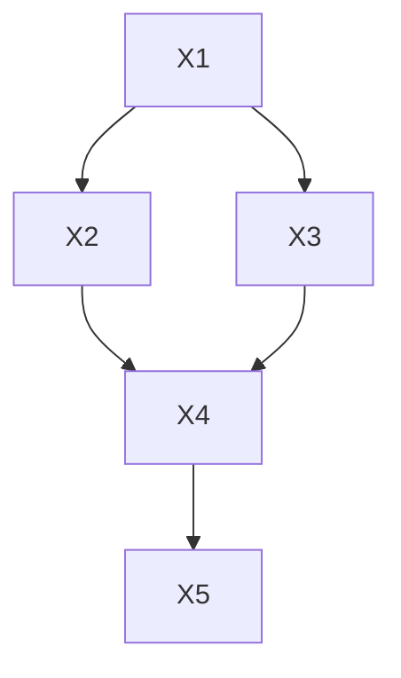

# 贝叶斯网络

## 贝叶斯规则

变形条件概率公式，计算后验概率：

$$
P(H|E)=\frac{P(E|H)P(H)}{P(H)P(E|H)+P(\bar{H})P(E|\bar{H})}
$$

## 贝叶斯网络

贝叶斯网络是一个概率图形模型，它通过一个有向无环图（Directed Acyclic Graph，DAG）
来表示一组变量及其条件依赖关系。从形式上讲，贝叶斯网络是有向无环图，其节点表示变
量。每条边表示一个直接的条件依赖关系。任何一对未连接的节点（即没有路径将一个节点
连接到另一个节点）表示变量在条件上彼此独立。

例子：记X1:SEASON, X2:RAIN, X3: SPRINKLER, X4: WET, X5: SLIPPERY，有如下贝叶斯网络：

图中的箭头代表真实的因果关系，而不是推理过程中的信息流（如在基于规则的系统和神经网络中）。

贝叶斯网络通过把联合分布分解为每个变量的局部条件分布（给定其父节点）来实现紧
凑性。如果 $x_i$ 表示变量 $X_i$ 的某个知，$pa_i$ 表示$X_i$的父节点的某个值集，则 $P(x_i|pa_i)$ 表示这个条件分布。
贝叶斯网络的全局语义可以定义如下：

$$
P(x_1,\dots,x_n)=\Pi_i P(x_i|pa_i)  \tag{1}
$$

对于上述例子有：

$$
P(x_1,x_2,x_3,x_4,x_5)=P(x_1)P(x_2|x_1)P(x_3|x_1)P(x_4|x_2,x_3)P(x_5|x_4)
$$

除了全局语义，贝叶斯网络还有一个**完全等价**的局部语义，它断言在网络中，给定其父节点，每个变量都独立于其**非后代**节点。例如上图中$X_4$的父节点为$X_2$,$X_3$，它们使$X_4$独立于剩余的非后代节点$X_1$，即

$$
P(x_4|x_1,x_2,x_3)=P(x_4|x_2,x_3)  \tag{2}
$$

以这种方式形成的独立性断言集合足以推导出方程（1）中的全局断言，反之亦然。具体而言，

- 从局部语义推出全局语义：从图的底层节点出发，假设最地层仅一个节点：$P(x_1,\dots,x_n)=P(x_n|x_1,\dots,x_{n-1})P(x_1,\dots,x_{n-1})$，
根据局部语义可以将 $P(x_n|x_1,\dots,x_{n-1})$ 化简，而 $P(x_1,\dots,x_{n-1})$ 可以继续从底层节点展开。

- 从全局语义推出局部语义：以上面（2）为例： $P(x_4|x_1,x_2,x_3)=P(x_1,x_2,x_3,x_4)/P(x_1,x_2,x_3)$，此时右侧式子都可以按全局语义展开，分别为：$P(x_1)P(x_2|x_1)P(x_3|x_1)P(x_4|x_2,x_3)$，$P(x_1)P(x_2|x_1)P(x_3|x_1)$，
相除后结果即为 $P(x_4|x_2,x_3)$

局部语义在构建贝叶斯网络时最有用，因为选择给定变量的直接原因作为父节点会自动满足局部条件独立性条件。全局语义则直接导致了多种推理算法的产生。

可以用网络中指定的条件概率来表达任何所需命题的概率。例如，在路面湿滑的情况下，洒水器开启的概率是：

$$
\begin{align*}
P(X_3 = \text{on} \mid X_5 = \text{true}) 
    &= \frac{P(X_3 = \text{on}, X_5 = \text{true})}{P(X_5 = \text{true})} \\
    &= \frac{\sum\limits_{x_1,x_2,x_4} P(x_1,x_2,X_3 = \text{on}, x_4, X_5 = \text{true})}{\sum\limits_{x_1,x_2,x_3,x_4} P(x_1,x_2,X_3,x_4,X_5 = \text{true})} \\
    &= \frac{\sum\limits_{x_1,x_2,x_4} P(x_1)P(x_2 \mid x_1)P(X_3 = \text{on} \mid x_1)P(x_4 \mid x_2, X_3 = \text{on})P(X_5 = \text{true} \mid x_4)}{\sum\limits_{x_1,x_2,x_3,x_4} P(x_1)P(x_2 \mid x_1)P(x_3 \mid x_1)P(x_4 \mid x_2, x_3)P(X_5 = \text{true} \mid x_4)}
\end{align*}
$$

