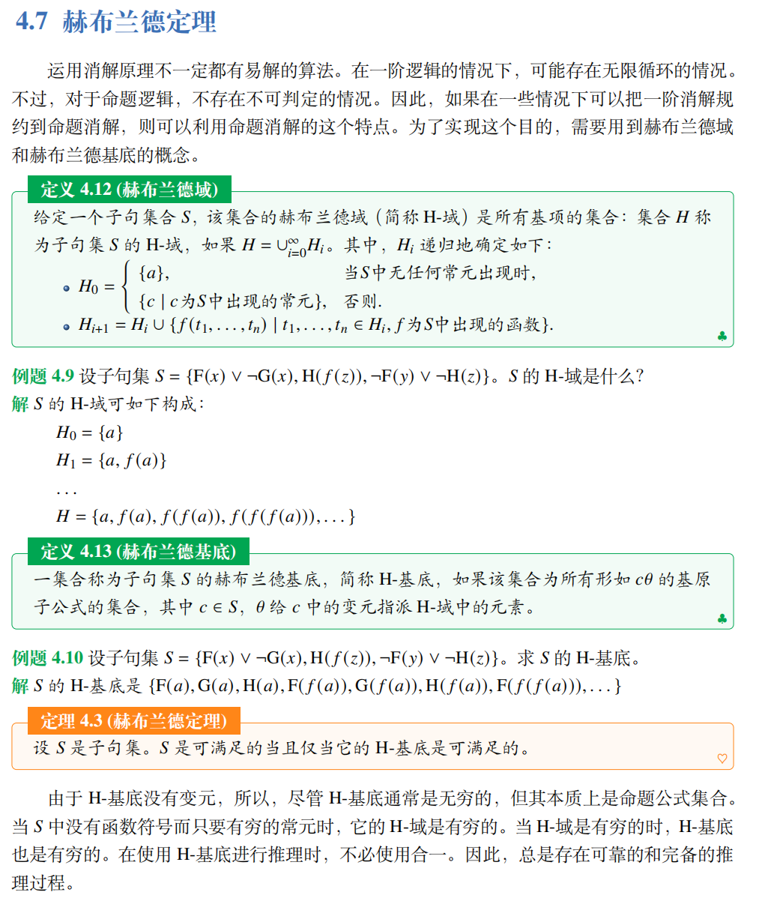

# 一阶逻辑

## 谓词和量词

**论域**：所有被讨论对象的集合  
**个体**：论域中的元素，即被讨论的对象

**常元**：用于表示确定对象的符号。例如，可以用“ZS”表示个体“张三”。  
**变元**：是用于表示给定论域上的任意一个对象的符号。例如，给定全总个体域，语句“𝑥 是学生”中，𝑥 是变元。  
**函词**：给定一个论域，从一组个体到一个个体映射关系可以用函词来描述。
例如，用 𝑔(ZS) 表示“张三的哥哥”。其中，𝑔(𝑥) 是 𝑥 的函词，表示“𝑥 的哥哥”。  

**项**：把个体常元和个体变元统称项。  
**谓词**：用于描述个体之间的关系。

## 一阶语言

一阶语言包含七类符号：  
个体常元：a b c  
个体变元：x y z  
函数符号：f g h  
关系符号：F G H  
量词符号：$\forall, \exist$  
联结符号：$\lor, \land$等  
标点符号：左括号，右括号，逗号

??? info "项"
    项可如下定义：

    (1) 变元和常元是项。

    (2) 如果 t1, . . . , t𝑚 是项，f 是 𝑚 元函数符号，则 f(t1, . . . , t𝑚) 是项。

    (3) 只有有限次使用 (1)(2) 条款生成的符号串才是项。

??? info "公式"
    公式可以定义如下：

    (1) F(t1, . . . , t𝑛) 是公式，称为原子公式。其中，F 是 𝑛 元关系符号，且 t1, . . . , t𝑛 是项。
    
    (2) 如果 t1 和 t2 是项，那么 (t1 ≡ t2) 是原子公式。

    (3) 如果 𝜙 和 𝜓 是公式，且 𝑥 是出现于 𝜙 中的自由变元，则 (¬𝜙)，(𝜙 ∧ 𝜓)，(𝜙 ∨ 𝜓)，(𝜙 → 𝜓), (𝜙 ↔ 𝜓)，(∀𝑥𝜙), (∃𝑥𝜙) 是公式。

    (4) 只有有限次使用 (1)(2)(3) 条款生成的符号串才是公式。

??? info "代换"
    代换 $\theta$ 是一个有限的对子集合 $\{x_1/t_1,\dots, x_n/t_n\}$，其中 $x_i$ 是变元，$t_i$ 是项。
    如果 $\phi$ 是一个公式，$\theta$ 是一个代换，则 $\phi\theta$ 是一个公式。
    在该公式中，所有 $x_i$ 的出现都被替换为 $t_i$。有时，我们也把 $\phi\{x/t\}$    作 $\phi^{x}_t$

## 语义

给定论域 𝐷，解释是一个映射，把个体符号映射为 𝐷 中的对象，把 𝑛 元函数符号映射为从 𝐷𝑛 到 𝐷 的函数，把 𝑛 元关系符号映射为 𝐷 上的 𝑛 元关系。
另一方面，对于每个自由变元，可以把论域中的对象指派给它。因此，指派也是一个映射。我们把解释和指派统称作赋值，记作𝑣。

??? info "解释/指派"
    给定论域 $D$，我们有：

    - 对于个体常元 a, 把它解释为的论域中的个体，记作 $v(a)\in D$。

    - 对于 𝑛 元函数符号 f, 把它解释为从 $D^n$ 到 𝐷 的函数，记作 $v(f): D^n\mapsto D$

    - 对于 𝑛 元谓词符号 F, 把它解释为 𝐷 上的 𝑛 元关系，记作 $v(F)\subset D^n$

    - 对于自由变元 x，给它指派 𝐷 中的个体，记作 𝑣(x) ∈ 𝐷。
    通常把 𝑣(a), 𝑣(f), 𝑣(F), 𝑣(x) 分别记作 $a^v,f^v, F^v,x^v$.

!!! info "项的值"
    一阶逻辑语言的项在以 $D$ 为论域的赋值 $v$ 下的值递归地定义如下：
    1. $a^v,x^v\in D$
    2. $f(t_1,\dots,t_n)=f^v(t_1^v,\dots,t_n^v)$.

为了定义公式在赋值之下的真假值，我们约定如下使用符号的规定。设 𝑣 是以 𝐷 为论域的赋值，a ∈ 𝐷, x 是自由变元符号。
我们用 $v(x/a)$ 表示一个以 𝐷 为论域的赋值，它除了 $x^{v(x/a)}=a$ 之外，和 $v$ 完全相同。

!!! info "公式的真假值"
    - $F(t_1,\dots,t_n)=\begin{cases}
    1,& \text{if}(t_1^v,\cdots,t_n^v)\in F^v\\
    0, & \text{else}
    \end{cases}$

    - $(\neg \phi)^v=\begin{cases}
    1, & \text{if}\phi^v=0\\
    0, & \text{otherwise}
    \end{cases}$

    - $(t_1\equiv t_2)=\begin{cases}
    1,&\text{if}t_1^v, t_2^v \text{is the same in} D\\
    0,&\text{otherwise}
    \end{cases}$

    - $(\phi \land \psi)^v =
    \begin{cases}
    1, & \text{if } \phi^v = \psi^v = 1 \\
    0, & \text{otherwise}
    \end{cases}$

    - $(\phi \lor \psi)^v =
    \begin{cases}
    1, & \text{if } \phi^v = 1 \text{ or } \psi^v = 1 \\
    0, & \text{otherwise}
    \end{cases}$

    - $(\phi \rightarrow \psi)^v =
    \begin{cases}
    1, & \text{if } \phi^v = 0 \text{ or } \psi^v = 1 \\
    0, & \text{otherwise}
    \end{cases}$

    - $(\phi \leftrightarrow \psi)^v =
    \begin{cases}
    1, & \text{if } \phi^v =\psi^v\\
    0, & \text{otherwise}
    \end{cases}$

    - $\top^v=1$

    - $\bot^v=0$

    - $\forall x\phi^v=\begin{cases}
    1,&\text{if}\phi^{v(x/a)}=1,\text{for any } a\in D\\
    0,&\text{otherwise}
    \end{cases}$

    - $\exist x\phi^v=\begin{cases}
    1,&\text{if exist } a\in D \text{ s.t. } \phi^{v(x/a)}=1,\\
    0,&\text{otherwise}
    \end{cases}$

### 逻辑推论

与命题逻辑对应，给定一组一阶公式集合 $\Phi$ 作为前提，我们希望知道 $\Phi$ 是否在逻辑上蕴涵某个结论 $\phi$。

!!! info "逻辑推论"
    设 $\Phi$ 是一组公式集合，$\phi$ 是一个公式。逻辑推论 $\Phi \models \phi$ 成立，
    当且仅当对于任意非空论域 $D$ 下的赋值 $v$，如果 $\Phi^v=1$ 则 $\phi^v=1$。

!!! info "可满足性与有效性"
    设 $\psi$ 是一个一阶公式
    - $\psi$ 是有效的，即 $\models \psi$ 当且仅当对于任意论域 $D$ 下任何赋值 $v,\psi^v=1$
    - $\psi$ 是可满足的，当且仅当存在某个论域 $D$ 下的赋值 $v$ 使 $\psi^v=1$

### 前束范式

!!! info "前束范式"
    称一阶逻辑公式 𝜙 为前束范式，当且仅当它有如下的形式：
    $$Q_1x_1... Q_nx_n\phi' $$

    其中的 $Q_1...Q_n$ 是 ∀ 或 ∃，并且 𝜙′ 不含量词。
    称 $Q_1x_1... Q_nx_n $ 为前束词，称 𝜙′ 为母式。
    前束范式的母式可以进一步变换为合取范式或析取范式。

### 消解原理

#### 一阶消解推演规则

当对包含自由变元的子句进行消解时，如果这些子句都是全称量化的，则可以去掉量词。在一阶消解中，需要考虑如何把消解规则应用于包含变元的子句。由于包含变元的子句是全称量化的，在证明可满足性时，可以使用这些字句的实例。

- 例：{ [𝑃(𝑥), ¬𝑅(𝑎, 𝑓 (𝑏, 𝑥))], [𝑄(𝑥, 𝑦)]} 表示的是
 ∀𝑥∀𝑦{ [𝑃(𝑥) ∨ ¬𝑅(𝑎, 𝑓 (𝑏, 𝑥))] ∧ 𝑄(𝑥, 𝑦)}。

!!! info "一阶消解推演规则"
    给定两个子句 𝑐1 ∪ {𝐿1} 和 𝑐2 ∪ {𝐿2}，如果它们没有公共变元，且存在一个代换 𝜃，使得𝐿1𝜃 = 𝐿2𝜃，
    那么可以推出子句 (𝑐1 ∪ 𝑐2)𝜃。这时我们说 𝜃 是 𝐿1 和 𝐿2 的合一。

#### 思科伦化

为了把包含存在量化的一阶公式转化为子句公式，需要引入斯科伦常元和斯科伦函数的概念。

思想：对于包含存在量词的公式，把该存在量词所管辖的变元变成确定的个体。

- ∃𝑥F(𝑥) 是可满足的，当且仅当对于某个具体的 𝑎，F(𝑎) 是可满足的，这里a就是思科伦常元。
- ∀𝑥∃𝑦G(𝑥, 𝑦)：在这个公式中，变元 𝑦 所指称的个体受变元 𝑥 限制的个体。
我们把这限制关系用函数来表达：对于某个函数 f，用 f(𝑥) 来代换 𝑦。

!!! info "思科伦化"
    把 $\forall x_1\forall x_2\dots\forall x_n \exists y \phi$
    变换为 $\forall x_1\forall x_2\dots\forall x_n \phi^y_f(x_1,x_2,\dots,x_n)$

!!! note "定理"
    (1) ∃𝑥𝜙 是可满足的，当且仅当 𝜙𝑥𝑎 是可满足的；
    (2) $\forall x_1\forall x_2\dots\forall x_n \exists y \phi$ 是可满足的，
    当且仅当 $\forall x_1\forall x_2\dots\forall x_n \phi^y_f(x_1,x_2,\dots,x_n)$ 是可满足的。
    其中，𝑎 是 𝜙 中未出现过的新常元，f 是 𝜙中未出现过的新 𝑛 元函词，它们被分别称为斯科伦常元和斯科伦函词。

### 赫布兰德定理

