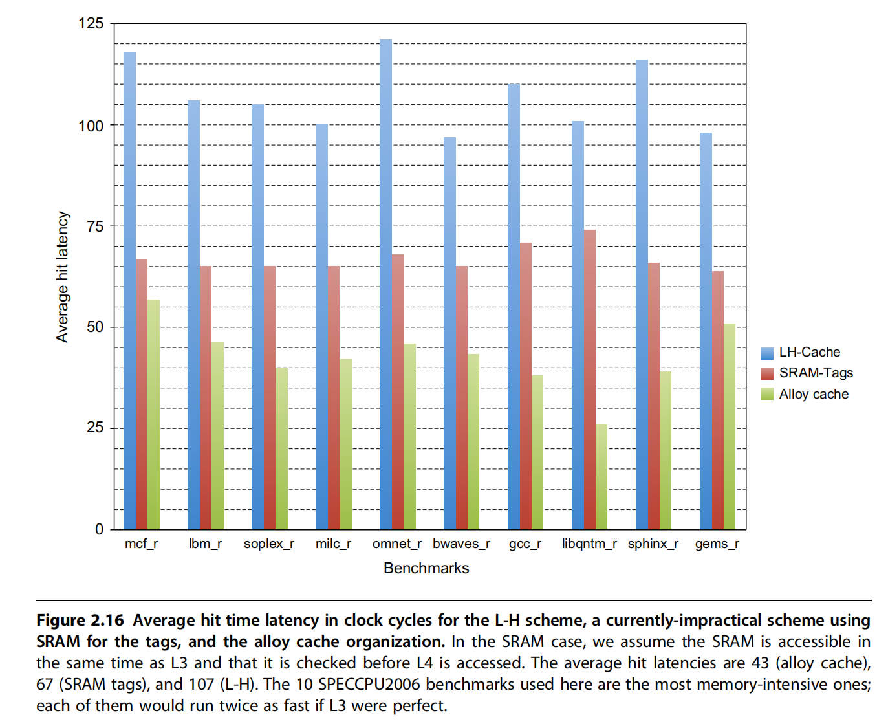

# HBM

## 基本概念

**HBM**（High Bandwidth Memory）是一种高带宽内存技术，专为满足现代计算任务中对大规模数据吞吐量的需求而设计。与传统的内存技术（如DDR、GDDR）相比，HBM的带宽要高得多，它主要用于**图形处理单元（GPU）**、**高性能计算（HPC）**、**人工智能**和**深度学习**等领域，以提升数据传输速率和系统性能。

## 主要特点

1. **3D堆叠设计：**
   - **HBM采用3D堆叠（stacked）技术**，将多个内存芯片垂直堆叠在一起，使用硅通孔（TSV）进行连接。这样设计的好处是减少了芯片之间的物理距离，从而提高了数据传输效率。
   - 由于每个内存芯片之间的连接非常短，数据可以在芯片之间更快速地传输，进一步减少了延迟并提高了带宽。

2. **高带宽：**
   - HBM提供比传统内存（如DDR或GDDR）更高的带宽，通常可以达到数百GB/s。比如，**HBM2**的带宽可以达到256GB/s甚至更高，而传统的DDR4内存带宽通常在几十GB/s左右。
   - 高带宽使得HBM非常适合需要频繁访问大量数据的应用，如图形处理、AI推理和科学计算等。

3. **低功耗：**
   - 由于其高效的带宽传输和低功耗设计，HBM相较于其他类型的内存（如GDDR）具有更低的功耗。
   - 在高性能计算和大型数据中心中，低功耗是一个非常重要的特性，能够帮助节省能源并降低运行成本。

## HBM的版本

- **HBM1**：第一代HBM技术，推出时每颗内存芯片的带宽大约为128GB/s，主要用于早期的高性能GPU。
- **HBM2**：第二代HBM，比HBM1有更高的带宽（最高可达256GB/s）和更大的容量，通常应用于更高级的GPU和高性能计算系统。
- **HBM2E**：HBM2的增强版，进一步提高了带宽（最高460GB/s）和存储容量，适用于对内存带宽要求极高的应用。
- **HBM3**：第三代HBM，未来将提供更高的带宽和更高的容量，预计会应用于更加复杂的AI训练、超算等领域。

---

## 如何优化缓存

使用HBM扩展存储器层次结构以优化缓存：

- L4缓存位于传统的L3缓存和主内存之间，是缓存层次结构中的一个较高层次，用于减缓处理器访问主内存的延迟。
- 核心思想：使用HBM作为大容量L4缓存，以利用HBM的高带宽、低延迟特性。

### 问题

1. **容量与块大小的矛盾**  
   - **目标**：使用HBM构建大容量L4缓存（如1 GiB），但块大小（Block Size）直接影响标签存储开销。
   - **具体矛盾点**：
     - **使用小数据块（64B）**：标签存储需求极大（1 GiB缓存需96 MiB标签），远超CPU片上SRAM容量。
     - **使用大数据块（4KiB）**：标签存储锐减至1 MiB，但引入两个严重问题：
       1. **碎片化**：未使用的数据块部分浪费缓存空间。
       2. **高缺失率**：块数量减少，导致冲突缺失（Conflict Miss）和一致性缺失（Coherence Miss）增加。

### 解决方案

#### 1.子块（Sub-blocking）

- **原理**：允许块内部分子块有效，缺失时仅传输有效子块。
- **作用**：缓解碎片化问题，但无法解决块数量减少导致的缺失率提升问题。

#### 2.标签与数据共存的HBM设计（L-H）

- **传统障碍**：标签与数据分离需两次DRAM访问（标签访问 + 数据访问），延迟过高。
- **Loh & Hill (L-H) 方案**：
  - **核心思想**：将标签和数据置于同一HBM行中，利用DRAM行缓冲（Row Buffer）特性减少延迟。
  - **实现**：
    - 每个HBM行包含标签和29个数据段，构成29路组相联缓存。
    - 访问时先打开行读取标签，命中后通过列（CAS）访问获取数据。
  - **延迟优化**：同一行的列访问延迟仅为新行访问的三分之一。

#### **3. 熔合缓存（Alloy Cache, Qureshi & Loh 2012）**

- **改进点**：
  - **标签与数据融合**：直接映射结构，标签和数据通过突发传输（Burst Transfer）一次性读取。
  - **延迟优势**：命中时间缩短至单HBM周期，比L-H方案快50%以上。
- **代价**：直接映射导致缺失率上升至L-H方案的1.1-1.2倍。

---

### **性能权衡与对比**

- 平均命中延迟：

- 加速比：

| **方案**            | **命中延迟** | **缺失率** | **结构复杂度**      |
|---------------------|--------------|------------|---------------------|
| 基于SRAM的标签       | 中等         | 最低       | 高（需大容量SRAM）  |
| L-H方案（29路组相联）| 高         | 中等       | 中等（行缓冲优化）  |
| 熔合缓存（直接映射） | 最低         | 较高       | 低（突发传输简化）  |

---

### **总结**

1. **核心挑战**：HBM作为L4缓存的标签存储需平衡块大小、延迟与缺失率。
2. **创新方案**：
   - **L-H方案**：通过行缓冲优化标签与数据共存，平衡延迟与关联性。
   - **熔合缓存**：牺牲部分缺失率换取极致低延迟，适用于延迟敏感场景。
3. **未来方向**：
   - 结合子块技术优化碎片化问题。
   - 探索混合映射策略（如动态调整块大小）。
   - 利用HBM带宽提升突发传输效率，进一步降低延迟。

这些方案体现了在存储器层次设计中，如何通过硬件-软件协同创新（如DRAM访问特性利用、缓存结构优化）解决容量与性能的矛盾。

